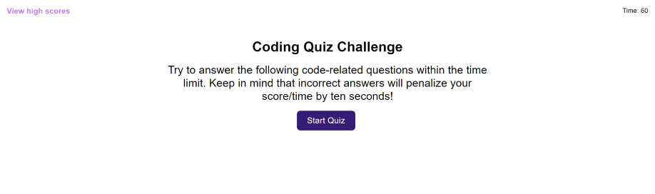
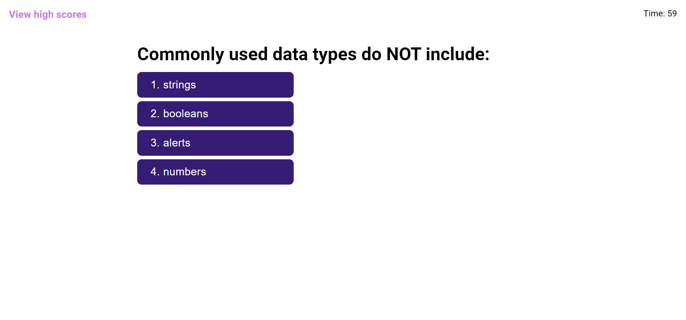
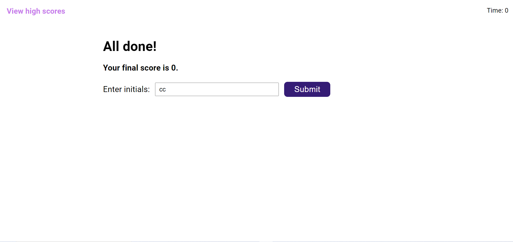
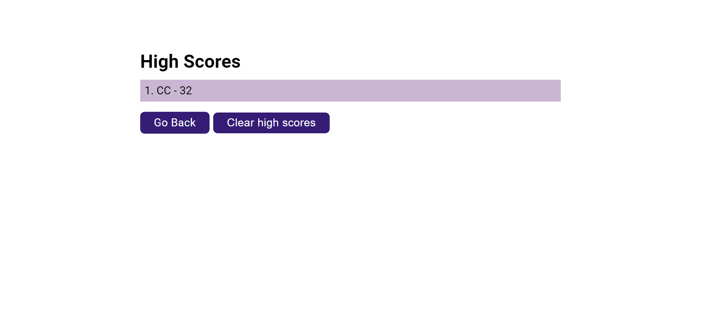

# Coding Assessment

## Description
A timed, interactive quiz application testing for basic JavaScript knowledge

##### Homescreen

##### Question Example 

##### Game Over

##### High Scores

Visit site [here](https://christopherconcannon.github.io/coding-assessment/)

## Table of Contents
  * [Installation](#installation)
  * [Usage](#usage)
  * [License](#license)
  * [Technologies](#technologies)
  * [Contributing](#contributing)
  * [Testing](#testing)
  * [Questions](#questions)
  
## Installation
Clone project to a directory on your local machine and cd into coding-assessment directory.  

## Usage
Open index.html file in browser of your choice.  Push button to start quiz and countdown.  Select the best answer to the questions.  If you answer incorrectly your time will be reduced by 10 seconds.  Your score will be the amount of time you have remaining at the end of the test.  You may then enter your initials to display in the high score list.  Good luck.

## License 
This project is covered under the MIT license 

## Technologies 
HTML5, CSS3, JavaScript

## Contributing
To see the guidelines adopted for contributing to this project, please view the [Contributor Covenant](https://www.contributor-covenant.org/version/2/0/code_of_conduct/code_of_conduct.txt)

## Testing
Tests coming soon

## Questions
Visit me at GitHub  
[christopherConcannon](https://github.com/christopherConcannon)
  
If you have any questions or would like to contact me, please email me at  
[cmcon@yahoo.com](mailto:cmcon@yahoo.com)
